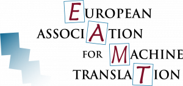
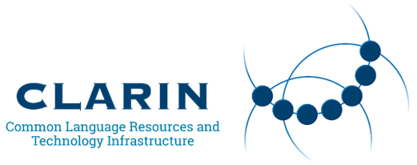

# MAchine Translation Evaluation Online (MATEO)

<p align="center">
  <a href="https://huggingface.co/spaces/BramVanroy/mateo-demo" target="_blank"></a>
  <a href="https://www.gnu.org/licenses/gpl-3.0" target="_blank"></a>
  
  
</p>

We present MAchine Translation Evaluation Online (MATEO), a project that aims to facilitate machine translation (MT)
evaluation by means of an easy-to-use interface that can evaluate given machine translations with a battery of
automatic metrics. It caters to both experienced and novice users who are working with MT, such as MT system builders,
and also researchers from Social Sciences and Humanities, and teachers and students of (machine) translation.

MATEO can be accessed on [this website](https://mateo.ivdnt.org/), 
hosted by the [CLARIN](https://www.clarin.eu/) B center at [Instituut voor de Nederlandse Taal](https://ivdnt.org/).
It is also available on Hugging Face [Spaces](https://huggingface.co/spaces/BramVanroy/mateo-demo).

If you use the MATEO interface for your work, please cite our project paper!

Vanroy, B., Tezcan, A., & Macken, L. (2023). [MATEO: MAchine Translation Evaluation Online](https://aclanthology.org/2023.eamt-1.52/). In M. Nurminen, J. Brenner, M. Koponen, S. Latomaa, M. Mikhailov, F. Schierl, … H. Moniz (Eds.), _Proceedings of the 24th Annual Conference of the European Association for Machine Translation_ (pp. 499–500). Tampere, Finland: European Association for Machine Translation (EAMT).

```bibtex
@inproceedings{vanroy-etal-2023-mateo,
    title = "{MATEO}: {MA}chine {T}ranslation {E}valuation {O}nline",
    author = "Vanroy, Bram  and
      Tezcan, Arda  and
      Macken, Lieve",
    booktitle = "Proceedings of the 24th Annual Conference of the European Association for Machine Translation",
    month = jun,
    year = "2023",
    address = "Tampere, Finland",
    publisher = "European Association for Machine Translation",
    url = "https://aclanthology.org/2023.eamt-1.52",
    pages = "499--500",
}
```

## Self-hosting

The MATEO [website](https://mateo.ivdnt.org/) is provided for free as a hosted application. That means that you, or
anyone else, can use it. The implication is that it is possible that the service will be slow depending on the usage of
the system. As such, specific attention was paid to making it easy for you to set up your own instance that you can use!

### Duplicating a Hugging Face Spaces

MATEO is also [running](https://huggingface.co/spaces/BramVanroy/mateo-demo) on the free platform of 🤗 Hugging Face in a
so-called 'Space'. If you have an account (free) on that platform, you can easily duplicate the running MATEO instance
to your own profile. That means that you can create a private duplication of the MATEO interface **just for you** and
free of charge! You can simply click [this link](https://huggingface.co/spaces/BramVanroy/mateo-demo?duplicate=true)
or, if that does not work, follow these steps:

1. Go to the [Space](https://huggingface.co/spaces/BramVanroy/mateo-demo);
2. in the top right (below your profile picture) you should click on the three vertical dots;
3. choose 'Duplicate space', _et&nbsp;voilà!_, a new space should now be running on your own profile

### Install locally with Python

You can clone and install the library on your own device (laptop, computer, server). I recommend to run this in a new
virtual environment. It requires `python >= 3.10`.

Run the following commands:

```shell
git clone https://github.com/BramVanroy/mateo-demo.git
cd mateo-demo
python -m pip install .
```

or using `uv` (recommended, faster):

```shell
uv pip install .
```

**Added in v1.6**: an optional, advanced option has been added in version 1.6 that allows you to insert arbitrary HTML in the `<head>` of your web app. If you do not need that functionality you can skip this step.

This can be useful in case you want to add analytics tracking, for instance. Due to the nature of Streamlit, adding `st.markdown` may not
work as you might expect since every user interaction will trigger a re-render of the page. In the case of counting page views, it may incorrectly
inflate those numbers. Therefore, we directly patch Streamlit's `index.html` file. Note that this is a grave security risk - never add anything
to the HTML file that you do not understand!!

To add your HTML contents to the head, e.g. a `<script src="...>`, create an HTML file with your content, e.g. `my_content.html`. Then run this script:

```shell
python scripts/patch_index_html.py --input_file my_content.html
```

This will back up the original script, too. If you ever want to restore that back up, just run:

```shell
python scripts/patch_index_html.py --restore
```

Now we can run MATEO!

```shell
cd src/mateo_st
streamlit run 01_🎈_MATEO.py
```

The streamlit server will then start on your own computer. You can access the website via a local address,
[http://localhost:8501](http://localhost:8501) by default.

Configuration options specific to Streamlit can be found
[on their website](https://docs.streamlit.io/library/advanced-features/configuration). They are more related to server-side configurations
that you typically do not need when you are running this directly through Python. But you may need them when you are
using Docker, e.g. setting the `--server.port` that streamlit is running on (see [Docker](#running-with-docker)).

A number of command-line arguments are available to change the interface to your needs.

```shell
--use_cuda  whether to use CUDA for translation task (CUDA for metrics not supported) (default: False)                                                                                                                                      
--demo_mode when demo mode is enabled, only a limited range of neural check-points are available. So all metrics are available but not all of the checkpoints. (default: False)
```

These can be passed to the Streamlit launcher by adding a `--` after the streamlit command and streamlit-specific
options, followed by any of the options above.

For instance, if you want to run streamlit specifically on port 1234 and you want to use the demo mode, you can modify
your command to look like this:

```shell
streamlit run 01_🎈_MATEO.py --server.port 1234 -- --demo_mode
```

Note the separating `--` in the middle so that streamlit can distinguish between streamlit's own options and the MATEO
configuration parameters.

### Running with Docker

MATEO is easily run with Docker. For more information see the instructions in [docker/instructions.md](docker/instructions.md).

## Tests

The tests are run using `pytest` and `playwright`. To ensure that the right dependencies are installed, you can run

```shell
python -m pip install -e .[dev]
```

or using `uv` (recommended):

```shell
uv pip install -e .[dev]
```

Then, install the appropriate chromium version for playwright. You can do this by running the following command.

```shell
playwright install --with-deps chromium
```

Now you can run the tests by running the following command in the root directory of the project.

```shell
python -m pytest
```

## Notes

### Using CUDA

Using CUDA for the metrics is currently not supported. However, it is possible to use CUDA for the translation task.
This can be done by setting the `--use_cuda` flag when running the Streamlit server. This will enable the use of CUDA
for the translation task, but not for the metrics. The reason for this is the memory consumption since streamlit 
creates a separate instance for each user, the GPU may run OOM quickly and moving on/off devices is not feasible. 

I have not found a solution for this yet. A queueing system would solve the issue with a separate backend and dedicated 
workers, but that defeats the purpose of having a simple, easy-to-use interface. It would also lead to the requirement
of strong data for longer, which many users may not want to, considering that I've received many questions whether I 
save their data on disk (I don't - the current approach processes everything in memory).

## Acknowledgements

This project was kickstarted by a Sponsorship project from the
[European Association for Machine Translation](https://eamt.org/), and
a substantial follow-up grant by the support of [CLARIN.eu](https://www.clarin.eu/).

<p align="center">
  <a href="https://eamt.org/" target="_blank"></a>
  <a href="https://www.clarin.eu/" target="_blank"></a>
</p>
